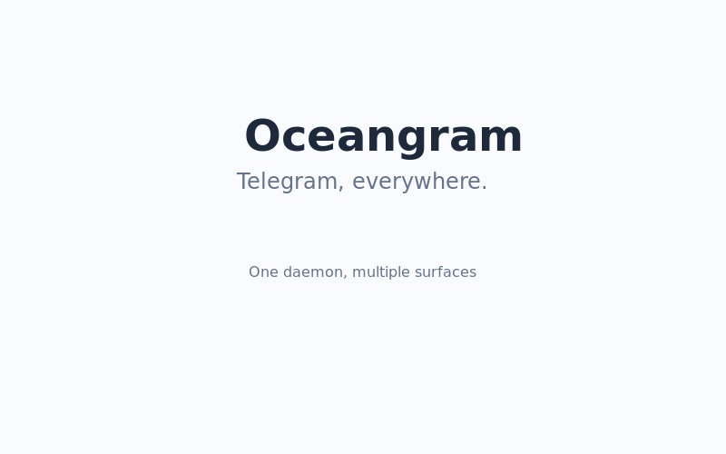

# 🪸 Oceangram

**Telegram, everywhere.** One daemon, multiple surfaces.

Oceangram is a universal Telegram client powered by a centralized daemon. Your Telegram session stays on your machine — no cloud, no third-party servers. The daemon exposes it via HTTP+WebSocket, and any surface can connect.

## Surfaces

| Surface | Status | Description |
|---------|--------|-------------|
| **Tray App** | ✅ Ready | macOS menu bar — minimal popup with whitelisted contacts |
| **VS Code / Cursor** | ✅ Ready | Extension with Telegram panel, AI agent integration |
| **CLI** | 🔜 Planned | Terminal-based Telegram client |
| **Web** | 🔜 Planned | Browser-based client via telegram-tt fork |

## Architecture

```

## Demo



_15-second feature showcase: VS Code Extension, Tray App, 100+ APIs, AI Integration_

┌─────────────┐  ┌──────────────┐  ┌───────────┐
│  Tray App   │  │  VS Code Ext │  │   CLI     │
└──────┬──────┘  └──────┬───────┘  └─────┬─────┘
       │                │                 │
       └────────────────┼─────────────────┘
                        │
              ┌─────────▼──────────┐
              │  Oceangram Daemon  │
              │  (localhost:7777)  │
              │   HTTP + WebSocket │
              └─────────┬──────────┘
                        │
              ┌─────────▼──────────┐
              │   Telegram MTProto │
              │   (your session)   │
              └────────────────────┘

       Optional:
              ┌────────────────────┐
              │  OpenClaw Gateway  │
              │  (AI enrichments)  │
              └────────────────────┘
```

## Features

### Daemon (100+ methods)
- Full messaging: send, edit, delete, forward, reply, schedule
- Media: photos, videos, documents, voice, stickers, GIFs
- Dialogs: list, search, pin, archive, mute, mark read
- Groups: admin tools, permissions, invite links, member management
- Account: privacy settings, 2FA, sessions, blocked users
- Real-time: WebSocket events for new messages, edits, deletions

### Tray App
- Ultra-minimal popup — whitelisted contacts as tabs
- Smart chat filter: unreads + recent conversations
- Message caching for instant tab switching
- Image paste, file drag-drop, reply context
- GitHub PR link previews with merge action
- AI summaries and smart replies (OpenClaw, feature-flagged)
- Popup animations, avatar loading, unread badges

### VS Code Extension
- Telegram messaging panel
- Send code/files to chat
- Terminal output capture
- Inline editor annotations
- AI agent integration (feature-flagged)

## Quick Start

### Tray App

```bash
cd packages/tray
pnpm install
pnpm run compile
pnpm run build:daemon
pnpm start
```

On first launch, you'll see a login screen. Enter your phone number and verification code. 2FA supported.

### VS Code Extension

```bash
cd packages/extension
pnpm install
pnpm run compile
# Install the .vsix in VS Code/Cursor
```

### Daemon (standalone)

```bash
cd packages/daemon
pnpm install
pnpm run build
node dist/server.js
```

## Configuration

### `~/.oceangram/config.json`

```json
{
  "whitelist": ["username1", "username2"],
  "features": {
    "openclaw": false
  },
  "openclaw": {
    "url": "ws://localhost:18789",
    "token": "your-token"
  }
}
```

### GitHub Integration

Store a GitHub personal access token at `~/.oceangram/github-token` for PR previews and merge actions.

## Monorepo Structure

```
oceangram/
├── packages/
│   ├── daemon/      — Telegram MTProto daemon (Fastify + gramjs)
│   ├── extension/   — VS Code/Cursor extension
│   └── tray/        — Electron menu bar app
├── logo.png
├── social.jpg
└── tsconfig.base.json
```

## Tech Stack

- **TypeScript** — everything, no JS
- **gramjs** — Telegram MTProto client
- **Fastify** — HTTP server for daemon
- **Electron** — Tray app
- **esbuild** — Extension bundling
- **pnpm** — Package manager

## Privacy

Your Telegram session never leaves your machine. The daemon runs locally, credentials are stored in `~/.oceangram/session/`. No cloud services required — OpenClaw integration is optional and feature-flagged.

## License

MIT

---

Built by [Ocean Vael](https://repo.box) 🪸
